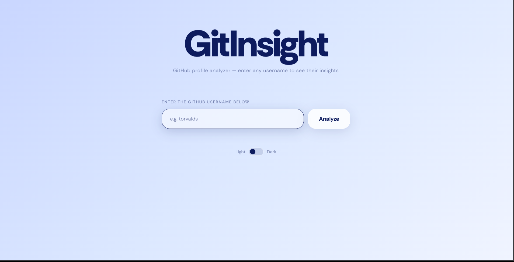

# GitInsight — GitHub Profile Analyzer

A clean, beautiful web app that analyzes any GitHub profile and displays their stats, most used languages, and top repositories — all in one page.

Built with **Python + Flask** as part of my **#7DaysOfPython** challenge.

---

## Live Demo

https://github-insight-1.onrender.com 

---

## Preview



---

## Features

- Search any public GitHub username
- Most used programming languages with animated bar chart
- Top 5 repositories sorted by stars
- Profile card with bio, followers, following, and location
- Total stats — repos, stars, and forks at a glance
- Light / Dark mode toggle
- Fully responsive — works on mobile and desktop
- No login required — uses GitHub's free public API

---

## Tech Stack

| Layer | Technology |
|---|---|
| Backend | Python, Flask |
| Frontend | HTML, CSS, Vanilla JS |
| Data | GitHub REST API (no auth needed) |
| Font | Rethink Sans (Google Fonts) |
| Deployment | Render (free tier) |

---

## Run Locally

**Requirements:** Python 3.x

**Step 1 — Clone the repo**
```bash
git clone https://github.com/YOUR_USERNAME/gitinsight.git
cd gitinsight
```

**Step 2 — Install dependencies**
```bash
pip install flask requests
```

**Step 3 — Run the app**
```bash
python app.py
```

**Step 4 — Open in browser**
```
http://localhost:5000
```

Type any GitHub username (try `torvalds` or your own) and hit Analyze.

---

## Project Structure

```
gitinsight/
├── app.py              ← Flask backend, GitHub API calls
├── templates/
│   └── index.html      ← Frontend UI (HTML + CSS + JS)
├── requirements.txt    ← Python dependencies
└── README.md
```

---

## How It Works

1. User enters a GitHub username in the search bar
2. Flask sends a request to `https://api.github.com/users/{username}`
3. A second request fetches all their public repositories
4. Python processes the data — counts languages, sorts repos by stars, totals up stats
5. Flask returns everything as JSON
6. The frontend renders it into a clean UI with animated bars

---

## API Used

GitHub's free public REST API — no API key or login required.

```
GET https://api.github.com/users/{username}
GET https://api.github.com/users/{username}/repos
```

---

## Deploy on Render

1. Push this repo to GitHub
2. Go to [render.com](https://render.com) and sign up with GitHub
3. Click **New Web Service** → connect this repo
4. Set the following:
   - **Build command:** `pip install -r requirements.txt`
   - **Start command:** `gunicorn app:app`
5. Hit **Deploy** — you'll get a live link in ~2 minutes

---

## What I Learnt Building This

- How to call a public REST API using Python's `requests` library
- How `response.status_code` works (200 = success, 404 = not found)
- How Flask routes work — `@app.route()` maps URLs to Python functions
- How to pass data from Python to the frontend using `jsonify()`
- How CSS variables make light/dark mode effortless to implement
- How `fetch()` in JavaScript sends data without reloading the page

---

## Part of #7DaysOfPython

This is **Day 2** of my 7 Days of Python challenge — building one real, useful project every day for 7 days.

---

## 📄 License

MIT — free to use, modify, and share.
